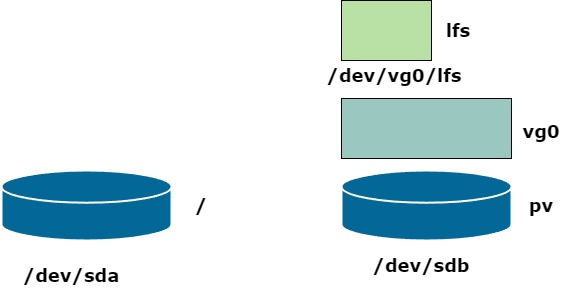

## Linux from scratch
### Part 01

1. Создал VM на Debian 11 с дополнительным HDD на 40GB
2. На дополнительном HDD создал LVM-раздел на 20GB и создал на нем ext4
``` 
apt install lvm2
pvcreate /dev/sdb
vgcreate vg0 /dev/sdb
lvcreate -L 20G -n lfs vg0 / lvcreate -l 100%FREE  -n lfs vg0
mkfs.ext4 /dev/vg0/lfs
vgdisplay vg0
lvdisplay /dev/vg0/lfs
```
Последние две команды - для просмотра созданных VolumeGroup и LogicalVolume. Для напоминания команды для вывода краткой информации по LVM
```
pvs | vgs | lvs
```


3. Создал директорию /mnt/lfs и systemd mount unit для монтирования в эту директорию логического тома lfs
```
mkdir /mnt/lfs
```
Содержимое юнита для монтирования `/etc/systemd/system/mnt-lfs.mount`:
```
[Unit]
Description=/mnt/lfs mount point

[Mount]
What=/dev/mapper/vg0-lfs
Where=/mnt/lfs
Type=ext4
DirectoryMode=0777
Options=defaults


[Install]
WantedBy=multi-user.target
```
После создания юнита делаем 
```
systemctl daemon-reload
systemctl enable mnt-lfs.mount
systemctl start mnt-lfs.mount
systemctl status mnt-lfs.mount
```
Проверяем монтирование тома и затем меняем его владельца
```
chown vagrant:vagrant /mnt/lfs
```
4. Проверяем систему на наличие нужных пакетов для сборки. Для этого запускаем скрипт из книги
```
./version-check.sh
```
В моем случае пришлось доустановить пакет `texinfo` и изменить ссылку `/bin/sh`, так как она указывала на файл `/bin/dash` вместо `/bin/bash`
```
apt install texinfo
ln -sf /bin/bash /bin/sh
```

5. Немного не в тему - полезный пакет для поиска пакета, содержащего имя файла - `apt-file`. Ниже пример установки и использования команды для поиска пакета, содержащего `yacc`. 
```
apt install apt-file
apt-file update
apt-file search yacc | grep "yacc$"
```
#### Part 02
1. Установим для пользователя переменную $LFS. В файл ~/.bashrc пропишем
```
export LFS=/mnt/lfs
```
2. Скачиваем необходимые пакеты. Список можно взять отсюда: https://www.linuxfromscratch.org/lfs/downloads/11.1/wget-list
3. Подсчитаем количество пакетов для скачивания:
```
wc -l wget-list
93 wget-list
```
4. Создадим скрипт для скачивания пакетов `wget.sh`:
```
#!/bin/bash
wget --input-file=wget-list --continue --directory-prefix=$LFS/sources
```
`--input-file` - файл со списком для закачки
`--continue` - продолжать закачку приобрыве
`--directory-prefix` - целевая дитектория для скачиваемых файлов  
5. Создадим целевую директорию
```
mkdir $LFS/sources
```
5. Запускаем скрипт `wget.sh` и проверяем количество файлов в директории `$LFS/sources`
```
ls -1 $LFS/sources | wc -l
91
```
---
Можно запустить закачку файлов в несколько потоков, используя запуск процессов в фоновом режиме. Для этого можно запустить простой скрипт:
```
for i in `cat wget-list`; do wget $i --continue --directory-prefix=$LFS/sources & done
```
--- 
Видим, что какие-то два файла не скачались. Как нам их найти? Скопируем содержимое директории `$LFS/sources` в файл `local_files` с предварительной сортировкой строк
```
ls -1 sources | sort > local_files
```
Теперь создадим список файлов, которые мы должны были получить при скачивании из `wget-list`. Для этого воспользуемся командой `awk`
```
awk -F"/" '{print $NF}' wget-list | sort > wget_files
```
-F"/" - определяем разделитель полей, таким образом мы можем разбить каждую строчку wget-list на отдельные элементы, разделяемые слэшем  
'{print $NF}' - вывести последний ($NF) элемент строки

Весь вывод команды мы перенаправляем в файл `wget_files`, получив в нем отсортированный полный список файлов, которые мы должны были получить. Теперь мы можем сравнить два файла и понять, какие пакеты у нас не скачались:
```
diff local_files wget_files
```
В итоге не скачалось два архива: zlib-1.2.11.tar.xz и expat-2.4.6.tar.xz. Вместо zlib-1.2.11.tar.xz был скачен zlib-1.3.1.tar.xz, а expat-2.4.6.tar.xz был закачен из другого источника.
```
wget https://zlib.net/zlib-1.3.1.tar.xz --continue --directory-prefix=$LFS/sources
wget https://github.com/libexpat/libexpat/releases/tag/R_2_4_6/expat-2.4.6.tar.xz --continue --directory-prefix=$LFS/sources
```
После повтрения процедуры сравнения списка необходимых и скаченных файлов убедились, что теперь все необходимые архивы у нас есть.

6. Теперь создадим директории для файловой системы LFS. Для этого запускаем скрипт dir.sh
```
#!/bin/bash
mkdir -pv $LFS/{etc,var} $LFS/usr/{bin,lib,sbin}
for i in bin lib sbin; do
ln -sv usr/$i $LFS/$i
done
case $(uname -m) in
x86_64) mkdir -pv $LFS/lib64 ;;
esac
```
Дополнительно создаем директорию tools
```
mkdir -pv $LFS/tools
```
Структура $LFS будет выглядеть так:
```
/mnt/lfs
├── bin -> usr/bin
├── etc
├── lib -> usr/lib
├── lib64
├── local_files
├── lost+found [error opening dir]
├── sbin -> usr/sbin
├── sources
├── tools
├── usr
│   ├── bin
│   ├── lib
│   └── sbin
├── var
```
7. Подгототавливаем пользователя. Для чего это нужно создать пользователя с нуля. Зачем?
При добавлении пользователя в окружении к нему могут подтянуться общие настройки из определенных "скелетных" файлов в том числе .bashrc, .profile и переменные окружения.
У нас есть два файла, которые, в частности, отвечают за инициализацию переменных - .bashrc и .profile (bash profile)
.profile подгружает наши переменные в том случае, если мы заходим удаленно на сервер. Когда мы вводим логин и пароль, в первую очередь стартует bash profile.
Так же есть файл /etc/bash.bashrc, который тоже зщапускается при запуске командной оболочки, он нам для проекта LFS не нужен.
Нам нужен чистый пользователь, у которго нет переменных, инициализированных в общей системе.
Добавляем пользователя lfs, добавляем его в группу lfs, создаем для него пароль, даем ему права sudo и делаем его владельцем директории $LFS
```
groupadd lfs
useradd -s /bin/bash -g lfs -m -k /dev/null lfs
passwd lfs
usermod -aG sudo lfs
chown -v lfs $LFS/sources
```
---
В команде useradd:   
-s /bin/bash - устанавливаем оболочку по умолчанию  
-g - указываем группу пользователя  
-m - создаем домашнюю директорию  
-k - указание на скелетный файл, который должен быть основой для создания пользователя, в нашем случае ткого файла нет (/dev/null), т.е. домашний каталог пользователя будет пустой

---

8. Настраиваем правильное рабочее окружение пользователя lfs.
В .bash_profile вставляем следующую строку
```
exec env -i HOME=$HOME TERM=$TERM PS1='\u:\w\$ ' /bin/bash
```
В этом файле устанавливаются значения переменных HOME, TERM, PS1, а также подтягивается файл bashrc
При входе в всистему пользователем lfs обычно считывается логин файл /etc/profile, содержащий несколько настроек и переменных окружения, а затем .bash_profile. Приведенная выше команда заменяет запускаемую по умолчанию оболочку новой с пустым окружением, за исключением переменных HOME, TERM и PS1.
Новый экземпляр shell является non-login shell, который читает и исполняет содержимое файла .bashrc, а не файлов /etc/profile или bash profile.
Устанавливаем следующее содержимое файла .bashrc
```
set +h
umask 022
LFS=/mnt/lfs
LC_ALL=POSIX
LFS_TGT=$(uname -m)-lfs-linux-gnu
PATH=/usr/bin
if [ ! -L /bin ]; then PATH=/bin:$PATH; fi
PATH=$LFS/tools/bin:$PATH
CONFIG_SITE=$LFS/usr/share/config.site
export LFS LC_ALL LFS_TGT PATH CONFIG_SITE
```
---
set +h - отключение hash-функции bash  
umask - устанавливаем права по умолчанию  
LFS, LC_ALL, LFS_TGT - переменные окруженияЮ, необходимые для сборки и компиляции  
PATH - путь до папки с исполняемыми файлами
if [ ! -L /bin ]; then PATH=/bin:$PATH; fi - если в нашей системе каталог /bin является симлинком, то в переменную PATH добавляем каталог /bin  
PATH=$LFS/tools/bin:$PATH - добавляем в PATH $LFS/tools/bin  
export LFS LC_ALL LFS_TGT PATH CONFIG_SITE - экспортируем переменные, т.е. они будут доступны в дочерних командных оболочках  

---


9. Устанавливаем правильные права на домашний каталог lfs:
```
chown -R lfs:lfs /home/lfs
```

10. Если в системе есть файл /etc/bash.bashrc, то его необходимо убрать:
```
[ ! -e /etc/bash.bashrc ] || mv -v /etc/bash.bashrc /etc/bash.bashrc.NOUSE
```
   
11. И создаем профиль пользователя, предварительно залогинившись от его имени
```
source ~/.bash_profile
```

11. Устанавливаем права на каталог /mnt/lfs
```
chown -R lfs:lfs /mnt/lfs
```
12.  Устанавливаем дополнительные права на папку sources 1777 (стики бит - все пользователи хоста будут иметь право создавать файлы в каталоге sources (но не удалять))
```
chmod -v a+wt $LFS/sources
```

11. 

12. 
   
